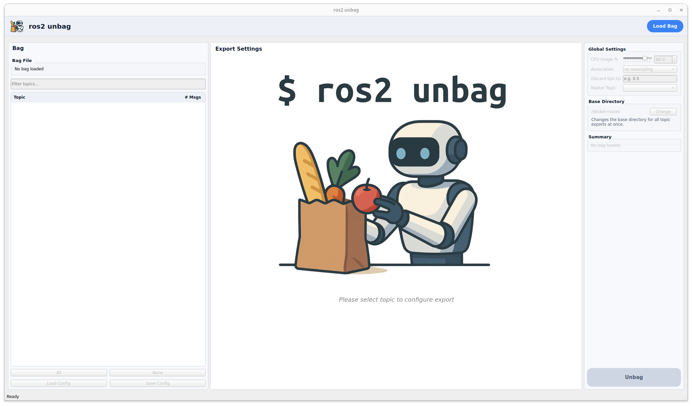

# *ros2 unbag* - fast ROS 2 bag export for any format

<p align="center">
  
  <a href="https://github.com/ika-rwth-aachen/ros2_unbag/releases/latest"></a>
  <a href="https://github.com/ika-rwth-aachen/ros2_unbag/actions/workflows/docker-ros.yml"></a>
</p>

*ros2 unbag* is a powerful ROS 2 tool featuring an **intuitive GUI** and **flexible CLI** for extracting topics from `.db3` or `.mcap` bag files into formats like CSV, JSON, PCD, images, and more.

- **🎨 Intuitive GUI interface** for interactive bag exploration and export configuration
- **⚙️ Full-featured ROS 2 CLI plugin**: `ros2 unbag <args>` for automation and scripting  
- **🔌 Pluggable export routines** enable export of any message to any type  
- **🔧 Custom processors** to filter, transform or enrich messages  
- **⏱️ Time‐aligned resampling** (`last` | `nearest`)  
- **🚀 Multi‐process** export with adjustable CPU usage  
- **💾 JSON config** saving/loading for repeatable workflows

## Table of Contents
- [Introduction](#introduction)
- [Installation](#installation)  
  - [From Source](#from-source)  
  - [Docker](#docker)  
- [Quick Start](#quick-start)  
  - [GUI Mode](#gui-mode-recommended-for-first-time-users)  
  - [CLI Mode](#cli-mode-for-automation--scripting)  
- [Documentation](#documentation)
  - [Export Routines](docs/EXPORT_ROUTINES.md) - Built-in and custom export formats
  - [Processors](docs/PROCESSORS.md) - Message transformation and filtering
  - [Advanced Usage](docs/ADVANCED_USAGE.md) - Config files, resampling, CPU tuning
- [Acknowledgements](#acknowledgements)

## Introduction
<p align="center">
  <a href="qt_resources/assets/GUI.png">
    
  </a>
</p>

The GUI makes it easy to inspect bag contents, select topics, configure export formats, build processor chains, and manage resampling. For automation and scripting workflows, the CLI provides the same export capabilities through command-line arguments or JSON configuration files.

It comes with export routines for [all message types](docs/EXPORT_ROUTINES.md) (sensor data, point clouds, images). You need a special file format or message type? Add your [own export plugin](docs/EXPORT_ROUTINES.md#custom-export-routines) for any ROS 2 message or format, and chain [custom processors](docs/PROCESSORS.md) to filter, transform or enrich messages (e.g. drop fields, compute derived values, remap frames).

Optional [resampling](docs/ADVANCED_USAGE.md#resampling) synchronizes your data streams around a chosen master topic—aligning each other topic either to its last‑known sample (“last”) or to the temporally closest sample (“nearest”)—so you get a consistent sample count in your exports.

For high‑throughput workflows, *ros2 unbag* can spawn multiple worker processes and lets you [tune CPU usage](docs/ADVANCED_USAGE.md#cpu-utilization). Your topic selections, processor chains, export parameters and resampling mode (last or nearest) can be saved to and loaded from a [JSON configuration](docs/ADVANCED_USAGE.md#configuration-files), ensuring reproducibility across runs.

Whether you prefer the **GUI for interactive exploration** or `ros2 unbag <args>` for automated pipelines, you have a flexible, extensible way to turn bag files into the data you need.

## Installation 

### From source

1. Create a ROS 2 workspace and clone the repository into `src`:

   ```bash
   mkdir -p ros2_ws/src
   git clone https://github.com/ika-rwth-aachen/ros2_unbag.git ros2_ws/src/ros2_unbag
   cd ros2_ws
   ```

2. Source your ROS 2 installation:

   ```bash
   source /opt/ros/<distro>/setup.bash
   ```

3. Install the package dependencies via `rosdep`:

   ```bash
   rosdep install --from-paths src --ignore-src -r -y
   ```

4. Build the package with `colcon`:

   ```bash
   colcon build --packages-select unbag
   ```

5. Source the workspace overlay:

   ```bash
   source install/setup.bash
   ```

### Docker 

You can skip local installs by running our ready‑to‑go Docker image:

```bash
docker pull ghcr.io/norlab-ulaval/ros2_unbag:latest
```

This image comes with ROS 2 Jazzy and *ros2 unbag* preinstalled. To launch it:

1. Clone or download the `docker/docker-compose.yml` in this repo.
2. Run:

   ```bash
   docker compose -f docker/docker-compose.yml up
   ```
3. If you need the GUI, first enable X11 forwarding on your host (at your own risk!):

   ```bash
   xhost +local:
   ```

   Then start the container as above—the GUI will appear on your desktop.


## Quick Start

*ros2 unbag* offers both an **intuitive GUI** for interactive workflows and a **powerful CLI** for automation and scripting.

### GUI Mode (Recommended for First-Time Users)

Launch the interactive graphical interface:

```bash
ros2 unbag
```


### CLI Mode (For Automation & Scripting)

Run the CLI tool by calling *ros2 unbag* with a path to a rosbag and an export config, consisting of one or more topic:format:[subdirectory] combinations:

```bash
ros2 unbag <path_to_rosbag> --export </topic:format[:subdir]>…
```

Alternatively, you can load a config file. In this case, you do not need any `--export` flag:
```bash
ros2 unbag <path_to_rosbag> --config <config.json>
```
The config file structure is described [here](./docs/ADVANCED_USAGE.md#configuration-file-structure).

In addition to these required arguments, the following optional flags are available:
| Flag                        | Value/Format                             | Description                                                                                                                       | Usage                              | Default        |
| --------------------------- | ---------------------------------------- | --------------------------------------------------------------------------------------------------------------------------------- | ---------------------------------- | -------------- |
| **`bag`**                   | `<path>`                                 | Path to ROS 2 bag file (`.db3` / `.mcap`) or split bag folder.                                                                    | CLI mode (required)                | –              |
| **`-e, --export`**          | `/topic:format[:subdir]`                 | Topic → format export spec. Repeatable.                                                                                           | CLI mode (required or `--config`)  | –              |
| **`-o, --output-dir`**      | `<directory>`                            | Base directory for all exports.                                                                                                   | Optional                           | `.`            |
| **`--naming`**              | `<pattern>`                              | Filename pattern. Supports `%name`, `%index`, `%timestamp`, `%master_timestamp` (when resampling), and strftime (e.g. `%Y-%m-%d_%H-%M-%S`) using ROS timestamps | Optional                           | `%name_%index` |
| **`--resample`**            | `/master:association[,discard_eps]`.     | Time‑align to master topic. `association` = `last` or `nearest`; `nearest` needs a numeric `discard_eps`.                         | Optional                           | –              |
| **`-p, --processing`**      | `/topic:processor[:arg=value,…]`         | Pre‑export processor spec; repeat to build ordered chains (executed in the order provided).                                       | Optional                           | –              |
| **`--cpu-percentage`**      | `<float>`                                | % of cores for parallel export (0–100). Use `0` for single‑threaded.                                                              | Optional                           | `80.0`         |
| **`--config`**              | `<config.json>`                          | JSON config file path. Overrides all other args (except `bag`).                                                                   | Optional                           | –              |
| **`--gui`**                 | (flag)                                   | Launch Qt GUI. If no `bag`/`--export`/`--config`, GUI is auto‑started.                                                            | Optional                           | `false`        |
| **`--use-routine`**         | `<file.py>`                              | Load a routine for this run only (no install).                                                                                    | Optional                           | –              |
| **`--use-processor`**       | `<file.py>`                              | Load a processor for this run only (no install).                                                                                  | Optional                           | –              |
| **`--install-routine`**     | `<file.py>`                              | Copy & register custom export routine.                                                                                            | Standalone                         | –              |
| **`--install-processor`**   | `<file.py>`                              | Copy & register custom processor.                                                                                                 | Standalone                         | –              |
| **`--uninstall-routine`**   | (flag)                                   | Interactive removal of an installed routine.                                                                                      | Standalone                         | -              |
| **`--uninstall-processor`** | (flag)                                   | Interactive removal of an installed processor.                                                                                    | Standalone                         | -              |
| **`--help`**                | (flag)                                   | Show usage information and exit.                                                                                                  | Standalone                         | -              |

Example:
```bash
ros2 unbag rosbag/rosbag.mcap 
    --output-dir /docker-ros/ws/example/ --export /lidar/point_cloud:pointcloud/pcd:lidar --export /radar/point_cloud:pointcloud/pcd:radar --resample /lidar/point_cloud:last,0.2
```

⚠️ If you specify the `--config` option (e.g., `--config configs/my_config.json`), the tool will load all export settings from the given JSON configuration file. In this case, all other command-line options except `<path_to_rosbag>` are ignored, and the export process is fully controlled by the config file. The `<path_to_rosbag>` is always required in CLI use.

## Documentation

For detailed information on advanced features, see the following guides:

- **[Export Routines](docs/EXPORT_ROUTINES.md)** - Complete guide to built-in export formats (images, point clouds, CSV, JSON, etc.) and creating custom export routines
- **[Processors](docs/PROCESSORS.md)** - Message transformation and filtering, including processor chains and custom processors
- **[Advanced Usage](docs/ADVANCED_USAGE.md)** - Configuration files, resampling strategies, and CPU utilization tuning

## Acknowledgements
This research is accomplished within the following research projects:

| Project | Funding Source |      | 
|---------|----------------|:----:|
| <a href="https://www.ika.rwth-aachen.de/de/kompetenzen/projekte/automatisiertes-fahren/4-cad.html"></a> | Funded by the Deutsche Forschungsgemeinschaft (DFG, German Research Foundation) DFG Proj. Nr. 503852364 | <p align="center"></p> |
| <a href="https://iexoddus-project.eu/"></a> | Funded by the European Union’s Horizon Europe Research and Innovation Programme under Grant Agreement No 101146091 | <p align="center"></p> |
| <a href="https://synergies-ccam.eu/"></a> | Funded by the European Union’s Horizon Europe Research and Innovation Programme under Grant Agreement No 101146542 | <p align="center"></p> |

## Notice 

> [!IMPORTANT]  
> This repository is open-sourced and maintained by the [**Institute for Automotive Engineering (ika) at RWTH Aachen University**](https://www.ika.rwth-aachen.de/).  
> We cover a wide variety of research topics within our [*Vehicle Intelligence & Automated Driving*](https://www.ika.rwth-aachen.de/en/competences/fields-of-research/vehicle-intelligence-automated-driving.html) domain.  
> If you would like to learn more about how we can support your automated driving or robotics efforts, feel free to reach out to us!  
> :email: ***opensource@ika.rwth-aachen.de***
